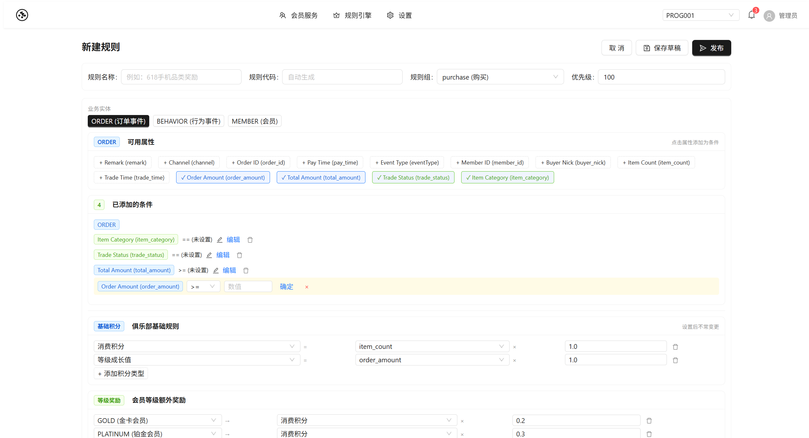

<p align="center">
  <h1 align="center">Loyalty Platform</h1>
  <p align="center">Omni-channel Loyalty Management Platform</p>
  <p align="center">全渠道忠诚度管理平台</p>
  <p align="center">
    
    
    
    
    
    
  </p>
</p>

---

## English

### Overview

Loyalty Platform is a **omni-channel loyalty management platform** built for enterprises operating across multiple retail channels (Tmall, JD.com, Douyin, WeChat Mini Programs). It provides a unified member identity system, flexible points accounting engine, rule-driven reward distribution, and visual workflow orchestration.

**Key Capabilities:**
- **Multi-Tenant Isolation** — 4-layer defense: HTTP filter → ORM interceptor → middleware sandbox → query sentinel
- **One-ID Enrollment** — Cross-channel member matching & deduplication (phone/UnionID/UserID)
- **Points Accounting** — FIFO waterfall redemption, negative balance risk control, credit limits
- **Drools Rule Engine** — DRL rules with hot-reload, AI-assisted generation, shadow sandbox regression testing
- **AI Rule Assistant** — Conversational AI (V4) with streaming SSE, clarification forms, dynamic formSchema generation, multi-scenario coverage (base rules, promos, tiered, cyclic)
- **LiteFlow Pipeline** — 7-component event processing chain with visual React Flow designer & hot-reload
- **Schema-Driven UI** — Dynamic entity model (JSONB ext_attributes) with REST API auto-generation
- **Cascade Recalculation** — Lock-free compensation for tier changes triggered by points adjustments

### Architecture

```
Frontend (React 18 + TypeScript + Ant Design 5)
  Dashboard | Rule Editor | Flow Designer | Schema Editor | ...
        │ REST API (/api/*)
        ▼
Backend (Spring Boot 3.2.5 + Java 17)
  SPI Gateway ──→ LiteFlow Pipeline (7 components)
  Drools Rules ──→ Points Accounting (FIFO + Waterfall)
  Cascade Recalculation ──→ Security (RBAC + JWT + Quota)
        │
        ▼
Data Layer: PostgreSQL 15+ (JSONB) | Redis 6.x+ | Kafka (optional)
```

### Tech Stack

| Layer | Technology |
|-------|-----------|
| Backend Framework | Spring Boot 3.2.5, Java 17 |
| ORM | Hibernate 6.4 + JPA, MyBatis-Plus 3.5.6 |
| Rule Engine | Drools 8.44.2 (KieBase Cache, StatelessKieSession) |
| Flow Orchestration | LiteFlow 2.12.4 (7 components, EL chain, hot-reload) |
| Scripting | GraalVM Polyglot (JavaScript sandbox) |
| Database | PostgreSQL 15+ (JSONB, RLS, pg_partman) |
| Cache | Redis 6.x+ (Redisson 3.30) |
| Messaging | Kafka (optional, dev uses LocalEventBus) |
| Frontend | React 18, TypeScript, Ant Design 5 |
| Flow Designer | @xyflow/react (React Flow 11.x), Zustand |
| Code Editor | Monaco Editor |
| Testing | JUnit 5, Mockito, Playwright (E2E) |

### Quick Start

**Prerequisites:** Java 17+, PostgreSQL 15+, Redis 6.x+ (optional), Node.js 18+

```bash
# Backend
psql -U postgres -c "CREATE DATABASE loyalty_dev;"
psql -U postgres -d loyalty_dev -f src/main/resources/db/migration/V1_*.sql
mvn spring-boot:run

# Frontend
cd src/frontend
npm install && npm run dev

# Tests
mvn test -Dtest="RulesUnitTest,TenantKeyGeneratorTest,MergeTaskTest"
mvn test  # Full suite (requires PostgreSQL)
```

### Key API Endpoints

| Method | Path | Description |
|--------|------|-------------|
| `GET` | `/api/admin/rules` | List rule definitions |
| `POST` | `/api/admin/rules` | Create rule (DRAFT) |
| `POST` | `/api/admin/rules/{id}/publish` | Publish with regression test |
| `POST` | `/api/admin/rules/validate-drl` | Validate DRL syntax |
| `POST` | `/api/admin/rules/generate` | AI-assisted rule generation |
| `POST` | `/api/rules/ai/start` | Start AI rule assistant session |
| `POST` | `/api/rules/ai/clarify` | Streaming SSE clarification (text + question events) |
| `POST` | `/api/rules/ai/clarify/submit` | Submit clarification answers, get formSchema |
| `POST` | `/api/rules/ai/submit-form` | Submit form data, generate final rule |
| `POST` | `/api/rules/ai/save` | Save generated rule (draft or publish) |
| `GET`  | `/api/admin/llm-config` | Get LLM configuration |
| `PUT`  | `/api/admin/llm-config` | Save LLM configuration |
| `POST` | `/api/admin/llm-config/test` | Test LLM connection |
| `GET` | `/api/admin/flows` | List flow definitions |
| `POST` | `/api/admin/flows/{id}/publish` | Publish flow (LiteFlow hot-reload) |
| `POST` | `/api/events/{chainName}/{programCode}` | Execute LiteFlow event chain |
| `POST` | `/api/open/spi/{channel}/{programCode}/{action}` | SPI webhook for 3rd-party channels |
| `GET` | `/api/members/{id}` | Get member details |
| `POST` | `/api/members/merge` | Create member merge task |

### Project Structure

```
src/main/java/com/loyalty/platform/
├── accounting/         Points grant, redeem, compaction, negative risk
├── admin/              AdminController (programs, rules, flows, audit)
├── api/                REST controllers & services
├── cascade/            Cascade recalculation engine
├── common/             Shared utilities (cache, context, event, exception, filter, interceptor)
├── config/             Hibernate, MyBatis-Plus, RLS, Tenant configs
├── domain/             JPA entities, enums, converters, repositories
├── event/              EventInboxProcessor (state machine)
├── flow/               ** LiteFlow pipeline (7 components + EventContext + EventController)
├── job/                Scheduled jobs (TierEval, Compaction, Merge, Retry)
├── mapping/            ScriptingTransformer (GraalVM)
├── member/             OneIdEnrollmentService, MemberMergeService
├── notification/       Outbox, SMS, WeChat providers
├── rules/              Drools rule engine (Action, DRL, regression)
│   └── ai/             AI Rule Assistant (clarify, form generation, streaming)
├── security/           RBAC, JWT, QuotaBillingSentinel, AuditMonitor
└── spi/                SPI gateway (TMALL, JD, DOUYIN, WECHAT handlers)
```

### v7.3 Features

- **LiteFlow Pipeline** — 7-component event chain + React Flow visual designer
- **Package Restructure** — `com.loyalty.saas` → `com.loyalty.platform`
- **Rule Engine API** — 11 endpoints for rule CRUD, publish, sandbox, DRL test
- **Member Merge Saga** — Async merge with MergeTaskJob (SKIP LOCKED)
- **TenantKeyGenerator** — Tenant-aware Redis key generation
- **Event Time Extraction** — Multi-format business event time parsing
- **KieBase Draft Compilation** — `buildKieBaseWithDraft()` for shadow sandbox
- **AI Rule Assistant V4** — Conversational AI with streaming SSE, clarification forms, dynamic formSchema, multi-scenario (base/promo/tiered/cyclic)

### v7.4 — Campaign Tools (New)

**Campaign Tools** is a full-stack marketing planning & execution platform integrated with Loyalty. 12 modules, 27+ Flyway migrations, 100+ new files.

| Module | Description | Key API |
|--------|-------------|---------|
| **Planning Workspace** | Workspace → Goal → Initiative → Portfolio hierarchy | `/api/campaign/workspace` |
| **Opportunity Intelligence** | ML + RFM + external signal driven opportunity discovery | `/api/campaign/opportunity/discover` |
| **Marketing Decision Engine** | Budget allocation, attention budget, conflict arbitration, prioritization | `/api/campaign/decision/execute` |
| **Simulation & Optimization** | 3-layer simulation (Exposure→Behavior→Conversion), genetic algorithm optimization | `/api/campaign/simulation/run` |
| **Execution Engine (Zeebe)** | BPMN deploy, process start, worker execution, pause/resume | `/api/campaign/execution` |
| **Event System + Feedback Loop** | 13 event types, feedback metrics, model drift detection, strategy adjustment | `/api/campaign/feedback` |
| **Canvas → BPMN Compiler** | DAG JSON → Zeebe BPMN XML, semantic validation, AI DAG generation | `/api/campaign/canvas` |
| **Node Config Schema** | 12 node types with JSON Schema, pluggable NodeHandler framework | `/api/campaign/nodes` |
| **Content & Compliance** | Asset management, approval workflow, variable rendering, audit trail | `/api/campaign/content` |
| **Human Intervention** | Pause/resume/cancel, node skip, emergency throttle, kill switch | `/api/campaign/intervention` |
| **End-to-End Runtime** | Execution master/step/user-detail tracking, 10-state machine | `/api/campaign/execution` |

**Frontend Pages:** 11 dedicated campaign pages under `/campaign/*`
- Workspace List/Detail, Opportunity Intelligence, Decision Engine, Simulation & Optimization, Canvas Editor, Execution Monitor, Content Management, Intervention Dashboard, Feedback Analysis

### Screenshots

| Rule Configuration | Rule Engine Update |
|-------------------|---------------------|
|  |  |

| AI Rule Assistant | AI Assistant Form |
|-------------------|-------------------|
|  |  |

| AI Rule Preview | Member Service |
|-----------------|---------------|
|  |  |

---

## 中文

### 概述

Loyalty Platform 是一个**全渠道忠诚度管理平台**，面向跨零售渠道（天猫、京东、抖音、微信小程序）运营的企业。提供统一的会员身份体系、灵活的积分账务引擎、规则驱动的奖励分发和可视化流程编排。

**核心能力：**
- **多租户强隔离** — 四层防御体系：入口过滤 → ORM 拦截 → 中间件沙箱 → 查询哨兵
- **One-ID 入会** — 跨渠道会员匹配与去重（手机号/UnionID/UserID）
- **积分账务** — FIFO 瀑布流冲抵、负分风险控制、授信额度管理
- **Drools 规则引擎** — DRL 规则热更新、AI 辅助生成、影子沙箱回归测试
- **AI 规则助手** — 对话式 AI (V4)：流式 SSE 输出、澄清表单、动态 formSchema 生成、多场景覆盖（基础规则/活动/阶梯/循环）
- **LiteFlow 流水线** — 7 组件事件处理链 + React Flow 可视化设计器 + 热更新
- **Schema-Driven UI** — 动态实体模型（JSONB ext_attributes）+ REST API 自动生成
- **级联重算** — 等级变更触发积分无锁化补偿

### 架构

```
前端 (React 18 + TypeScript + Ant Design 5)
  Dashboard | Rule Editor | Flow Designer | Schema Editor | ...
        │ REST API (/api/*)
        ▼
后端 (Spring Boot 3.2.5 + Java 17)
  SPI 网关 ──→ LiteFlow 流水线 (7 组件)
  Drools 规则 ──→ 积分账务 (FIFO + 瀑布流)
  级联重算 ──→ 安全 (RBAC + JWT + 配额)
        │
        ▼
数据层: PostgreSQL 15+ (JSONB) | Redis 6.x+ | Kafka (可选)
```

### 技术栈

| 层级 | 技术 |
|------|------|
| 后端框架 | Spring Boot 3.2.5, Java 17 |
| ORM | Hibernate 6.4 + JPA（主）, MyBatis-Plus 3.5.6 |
| 规则引擎 | Drools 8.44.2（KieBase 缓存, StatelessKieSession） |
| 流程编排 | LiteFlow 2.12.4（7 组件, EL 链, 热更新） |
| 脚本引擎 | GraalVM Polyglot（JavaScript 沙箱） |
| 数据库 | PostgreSQL 15+（JSONB, RLS, pg_partman） |
| 缓存 | Redis 6.x+（Redisson 3.30） |
| 消息队列 | Kafka（可选，开发环境使用 LocalEventBus） |
| 前端 | React 18, TypeScript, Ant Design 5 |
| 流程设计器 | @xyflow/react（React Flow 11.x）, Zustand |
| 代码编辑器 | Monaco Editor |
| 测试 | JUnit 5, Mockito, Playwright（E2E） |

### 快速开始

**环境要求：** Java 17+, PostgreSQL 15+, Redis 6.x+（可选）, Node.js 18+

```bash
# 后端
psql -U postgres -c "CREATE DATABASE loyalty_dev;"
psql -U postgres -d loyalty_dev -f src/main/resources/db/migration/V1_*.sql
mvn spring-boot:run

# 前端
cd src/frontend
npm install && npm run dev

# 测试
mvn test -Dtest="RulesUnitTest,TenantKeyGeneratorTest,MergeTaskTest"
mvn test  # 全部测试（需要 PostgreSQL 连接）
```

### 主要 API 端点

| 方法 | 路径 | 说明 |
|------|------|------|
| `GET` | `/api/admin/rules` | 规则列表 |
| `POST` | `/api/admin/rules` | 创建规则（草稿） |
| `POST` | `/api/admin/rules/{id}/publish` | 发布规则（回归测试 + 热更新） |
| `POST` | `/api/admin/rules/validate-drl` | DRL 语法校验 |
| `POST` | `/api/admin/rules/generate` | AI 辅助规则生成 |
| `POST` | `/api/rules/ai/start` | 启动 AI 规则助手会话 |
| `POST` | `/api/rules/ai/clarify` | 流式 SSE 澄清对话（text + question 事件） |
| `POST` | `/api/rules/ai/clarify/submit` | 提交澄清答案，获取 formSchema |
| `POST` | `/api/rules/ai/submit-form` | 提交表单数据，生成最终规则 |
| `POST` | `/api/rules/ai/save` | 保存生成的规则（草稿或发布） |
| `GET`  | `/api/admin/llm-config` | 获取大模型配置 |
| `PUT`  | `/api/admin/llm-config` | 保存大模型配置 |
| `POST` | `/api/admin/llm-config/test` | 测试大模型连接 |
| `GET` | `/api/admin/flows` | 流程定义列表 |
| `POST` | `/api/admin/flows/{id}/publish` | 发布流程（LiteFlow 热更新） |
| `POST` | `/api/events/{chainName}/{programCode}` | 执行 LiteFlow 事件链 |
| `POST` | `/api/open/spi/{channel}/{programCode}/{action}` | 第三方渠道 SPI Webhook |
| `GET` | `/api/members/{id}` | 查询会员详情 |
| `POST` | `/api/members/merge` | 创建会员合并任务 |

### 项目结构

```
src/main/java/com/loyalty/platform/
├── accounting/         积分发放、兑换、压缩、负分风控
├── admin/              AdminController（Program、规则、流程、审计）
├── api/                REST 控制器与服务
├── cascade/            级联重算引擎
├── common/             公共工具（缓存、上下文、事件、异常、过滤器、拦截器）
├── config/             Hibernate, MyBatis-Plus, RLS, Tenant 配置
├── domain/             JPA 实体、枚举、转换器、仓储
├── event/              EventInboxProcessor（状态机）
├── flow/               ** LiteFlow 流水线（7 组件 + EventContext + EventController）
├── job/                定时任务（等级评估、积分压缩、合并、重试）
├── mapping/            ScriptingTransformer（GraalVM 脚本）
├── member/             OneIdEnrollmentService, MemberMergeService
├── notification/       消息推送（Outbox, SMS, 微信）
├── rules/              Drools 规则引擎（Action, DRL, 回归测试）
│   └── ai/             AI 规则助手（澄清对话、表单生成、流式输出）
├── security/           RBAC, JWT, QuotaBillingSentinel, AuditMonitor
└── spi/                SPI 网关（天猫/京东/抖音/微信处理器）
```

### v7.3 新特性

- **LiteFlow 流水线** — 7 组件事件处理链 + React Flow 可视化设计器
- **包结构重构** — `com.loyalty.saas` → `com.loyalty.platform`
- **规则引擎 API** — 11 个新端点：规则 CRUD、发布、沙箱验证、DRL 测试
- **会员合并 Saga** — 异步合并 + MergeTaskJob（SKIP LOCKED 并发安全）
- **TenantKeyGenerator** — 租户感知 Redis Key 生成器
- **事件时间提取** — 多格式业务时间解析（pay_time、trade、Unix 时间戳）
- **草稿规则编译** — `buildKieBaseWithDraft()` 支持影子沙箱回归
- **AI 规则助手 V4** — 对话式 AI：流式 SSE 输出、澄清表单、动态 formSchema、多场景覆盖（基础规则/活动/阶梯/循环）

### License

MIT